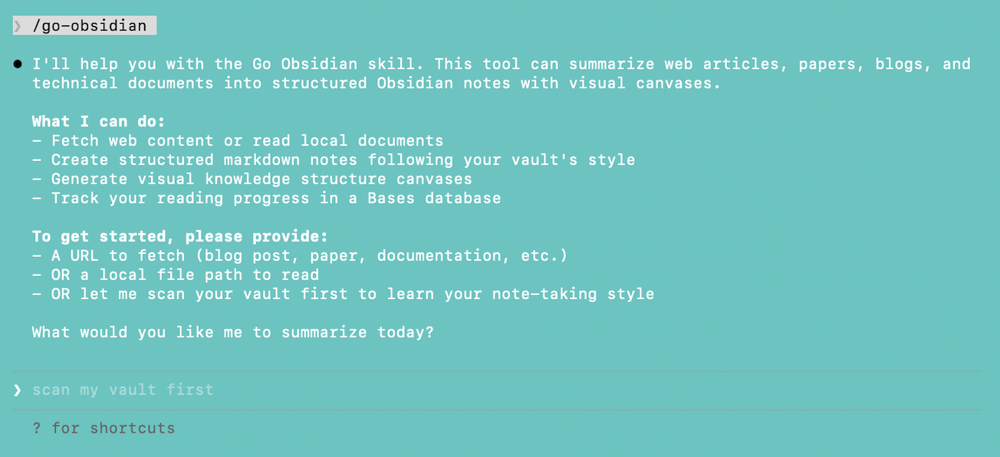

# go-obsidian
---
English | [中文](README_CN)
> A Skill that transforms any article into structured Obsidian notes with visual Canvas diagrams and reading progress management



[](https://claude.ai) [](https://obsidian.md) [](LICENSE.md) 

In the age of information explosion, we consume vast amounts of technical blogs, academic papers, social media threads, and official documentation every day. But reading is just the beginning—true knowledge accumulation happens when we organize and connect these fragments.

go-obsidian is a Skill that goes beyond simple article summarization. It's your **personal knowledge management assistant**:

- **It learns your note-taking style** — By analyzing your existing Obsidian vault, it automatically masters your tagging habits, Callout preferences, and Canvas color schemes (it adapts to you, not the other way around)
- **It creates visual knowledge graphs** — Transforming complex article content into structured Canvas diagrams that make knowledge relationships clear at a glance
- **It tracks your reading progress** — Through an intelligent database that automatically indexes all reading notes, letting you track your learning journey anytime
- **It maintains fidelity to the source** — No over-interpretation, no adding opinions not present in the original text, ensuring information integrity

Simply provide a URL or file path, and go-obsidian will generate a professional, structured reading note that matches your personal style, saved directly to your Obsidian vault. This Skill helps you efficiently capture fragmented information, build a habit of consistent reading and learning, and build your own knowledge base for LLM/Agent/yourself.

## Features

- 🌐 **Content Fetching** — Fetch and parse blogs, tweets, papers, and technical docs via WebFetch
- 📝 **Deep Summarization** — Generate faithful, structured Markdown notes following your style
- 🎨 **Visual Canvas** — Create knowledge structure diagrams with color-coded nodes
- 📊 **Reading Tracker** — Bases database for indexing and tracking reading progress
- 🧠 **Habit Learning** — Auto-learn and follow your note style, tags, and preferences

## Quick Start

### Installation

1. Clone or download this repository to your Claude Code skills directory:
   ```bash
   git clone https://github.com/yourusername/go-obsidian.git ~/.claude/skills/go-obsidian
   ```

2. The skill will be automatically detected by Claude Code.

### Basic Usage

Simply provide a URL or file path to Claude Code:

```
Summarize this article: https://example.com/interesting-blog-post
```

Claude will:
1. Scan your Obsidian vault for main content patterns (first use)
2. Learn your note-taking habits and continuously update its understanding of you
3. Fetch and analyze the content
4. Generate a structured `.md` summary
5. Optionally create a visual `.canvas` diagram
6. Define note properties to update the Reading Tracker

## How It Works

![[workflow.png]]
> 💡 *Made by Go-Obsidian*

## Project Structure

```
go-obsidian/
├── SKILL.md                 # Main skill definition
├── user-habits.md           # User preferences (auto-learned)
├── references.md            # Official documentation links
├── rules/
│   ├── canvas.md            # Canvas layout specifications
│   ├── content-types.md     # Content type detection rules
│   ├── fidelity.md          # Source fidelity guidelines
│   └── frontmatter.md       # Frontmatter conventions
├── syntax/
│   ├── obsidian-markdown.md # Obsidian Markdown syntax
│   ├── json-canvas.md       # JSON Canvas specification
│   └── obsidian-bases.md    # Obsidian Bases syntax
├── templates/
│   ├── canvas.json          # Canvas template
│   ├── reading-tracker.base # Reading tracker template
│   └── summary.md           # Summary note template
└── scripts/
    └── validate-canvas.sh   # Canvas validation script
```

## Configuration

### User Habits (`user-habits.md`)

This file stores your personal note-taking preferences:

- **Frontmatter habits** — Your preferred YAML properties and tag naming conventions (these settings are used by the Reading Tracker for configuration and indexing)
- **Tag naming** — The organizational architecture of your tags, mainly two styles:
  - **Hierarchical**: Uses slash nesting, e.g., `#AI/LLM`, `#Programming/Python`, suitable for scenarios requiring fine-grained categorization
  - **Flat**: Uses hyphens or underscores, e.g., `#AI-LLM`, `#Python_Programming`, suitable for fewer tags and pursuing simplicity
- **Callout usage** — Your preferred callout types. Here are common Obsidian Callout types and their icons:

  | Type | Icon | Purpose |
  |------|------|---------|
  | `[!info]` | ℹ️ | Information, background context |
  | `[!tip]` | 💡 | Tips, best practices |
  | `[!warning]` | ⚠️ | Warnings, potential issues |
  | `[!important]` | ❗ | Important content, core points |
  | `[!quote]` | 📜 | Original quotes, excerpts |
  | `[!note]` | 📝 | Supplementary notes, personal thoughts |
  | `[!success]` | ✅ | Success indicators, correct practices |
  | `[!question]` | ❓ | Questions, items to confirm |

- **Canvas style** — Color schemes (at least 3 colors required), node sizes, layout direction (top-to-bottom or left-to-right)
- **File naming** — Your naming conventions, such as `{Title} - Reading Notes.md` for notes or `YYYY-MM-DD` date format
- **Linking habits** — Your preference between Wikilinks (`[[Note]]`) vs Markdown links (`[Note](path)`), and alias usage (`[[Note|Display Name]]`)

The file is automatically populated on first use by scanning your existing vault. You can also manually adjust preferences at any time.

### Rules Directory

This directory defines the "instruction set" for how you want the Agent to execute tasks.

- **canvas.md** — Defines Canvas visual style specifications: color schemes (minimum 3 colors), node sizes, layout direction, edge connections. For example, you can specify title nodes in blue, core concepts in green, and summaries in purple.

- **content-types.md** — Processing strategies for different content types:
  - Blog/Technical Articles: Extract core arguments, code examples, practical recommendations
  - Papers: Preserve abstracts, methods, formulas, experimental results
  - Tweets/Threads: Focus on original post content, extract key links
  - Technical Docs: Organize quick starts, core features, API usage, common pitfalls
  - You can also specify: "Ask me before generating a Canvas for blog posts"

- **fidelity.md** — Content fidelity principles ensuring the Agent doesn't distort the original text:
  - ✅ Must preserve: Core arguments, key original expressions, data evidence, formulas, source attribution
  - ❌ Forbidden: Adding views not in original, over-simplifying to distortion, changing author's stance
  - Special use case support: If you want analysis from a specific perspective (e.g., "Evaluate this product from a marketing angle"), you can add instructions here

- **frontmatter.md** — Defines note metadata conventions, essential for the Reading Tracker to index notes correctly:
  - Required fields: `title`, `date`, `source`, `type` (blog/paper/tweet/doc), `status` (unread/reading/done), `progress` (0-100), `tags` (must include `reading-notes`)
  - Optional fields: `author`, `aliases`, `created`, etc.

### Syntax Directory

Syntax specification files derived from [kepano/obsidian-skills](https://github.com/kepano/obsidian-skills), including:
- **obsidian-markdown.md** — Obsidian Flavored Markdown syntax (Wikilinks, Embeds, Callouts, Properties)
- **json-canvas.md** — JSON Canvas file format specification (node types, edge properties, color codes)
- **obsidian-bases.md** — Obsidian Bases database syntax (filters, formulas, view configurations)

These files provide the Agent with complete Obsidian ecosystem syntax references, ensuring generated files are properly formatted and compatible.

### Templates Directory

Contains template files for Canvas, Summary, and Reading Tracker:
- **canvas.json** — Canvas structure template defining default layouts and color schemes for title nodes, concept nodes, content nodes, and summary nodes
- **reading-tracker.base** — Reading tracker database template with filters (only shows `#reading-notes` tagged files), formulas (status icons, progress bars, day calculations), and views (group by type, group by status, recent reading)
- **summary.md** — Note template with YAML Frontmatter, source info Callout, core content area, "My Thoughts" placeholder, etc.

If you need to add fixed content to generated notes (like copyright notices, related links, personal ratings), modify these templates directly. **Note**: After modifying templates, remember to sync the corresponding rule files in `rules/` to ensure consistency.

### Scripts Directory

Provides automation script tools, currently containing:
- **validate-canvas.sh** — Canvas validation script for checking if generated `.canvas` files meet specifications:
  - JSON syntax validation (quote escaping, commas, bracket matching)
  - Color usage validation (ensures at least 3 different colors used)
  - Node ID uniqueness check
  - Edge reference validity check (ensures `fromNode` and `toNode` point to real nodes)

Running this script can detect Canvas file format issues early, improving the success rate of one-shot generation.

### Reading Tracker

The `Reading Tracker.base` file is an Obsidian Bases database that **automatically indexes** all notes with the `#reading-notes` tag in your vault—no manual maintenance required. Whenever go-obsidian generates a new reading note, it automatically appears in the tracker.

**Core Features**:
- **Smart Filtering** — Only shows notes tagged with `#reading-notes`, automatically excluding other daily notes
- **Visual Progress** — Progress bars visually display reading completion for each note
- **Status Icons** — Icons distinguish unread (📖), reading (👀), and completed (✅) states
- **Source Icons** — Automatically identifies different source types: blog (📝), paper (📄), tweet (💬), doc (📚)
- **Time Tracking** — Shows days since last reading, helping you manage review cycles

**Three View Modes**:

| View | Description | Use Case |
|------|-------------|----------|
| All Notes | Overview grouped by source type (blog/paper/tweet/doc) | Browse overall reading history |
| By Status | Grouped by reading progress (unread/reading/done) | Manage reading todo list |
| Recent Reading | Notes active (created or updated) in last 7 days | View recent learning activity |

**How It Works**:
The Reading Tracker achieves intelligent indexing by reading the `type`, `status`, and `progress` fields from note Frontmatter. This is why these fields must be properly filled in as required by `rules/frontmatter.md`.

## Tools Used

| Tool | Purpose |
|------|---------|
| WebFetch | Fetch web content |
| Read | Read local PDF/papers, learn vault habits |
| Glob | Scan vault for .md/.canvas files |
| Write | Create .md and .canvas files |
| Edit | Update user-habits.md |

## Acknowledgments

Special thanks to [@kepano](https://github.com/kepano) for the excellent open-source Skill documentation and for creating such a great product. I believe it is one of the best AI interfaces of this era.

## License

MIT License — see [LICENSE](LICENSE.md) for details.

---

<p align="center">
  Made with ❤️ for the Obsidian community
</p>
