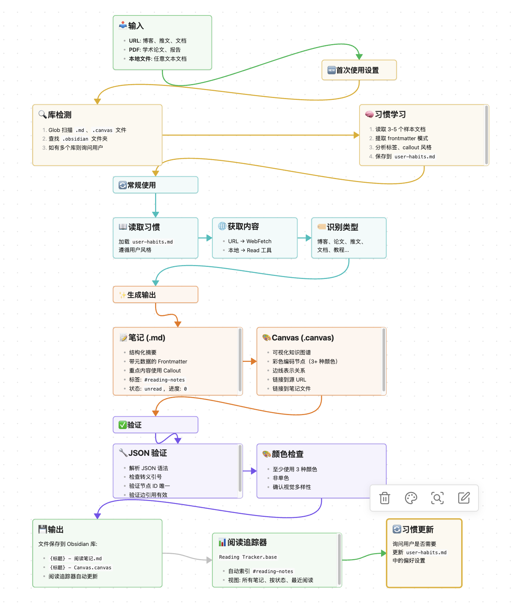

# go-obsidian

> 一个Skill，将任何文章转化为结构化的 Obsidian 笔记和可视化 Canvas 图，并进行阅读进度管理


[](https://claude.ai) [](https://obsidian.md) [](LICENSE.md)

在信息爆炸的时代，我们每天都在阅读大量的技术博客、学术论文、社交媒体推文和官方文档。但阅读只是开始——真正的知识积累发生在整理和连接这些碎片的过程中。

go-obsidian 是一个Skill，它不仅仅是一个文章总结工具，更是你的**私人知识管理助手**：

- **它会学习你的笔记风格** —— 通过分析你现有的 Obsidian 库，自动掌握你的标签习惯、Callout 偏好、Canvas 配色方案（让它来适应你而不是强迫你去适应，学习它）
- **它会创建可视化知识图谱** —— 将复杂的文章内容转化为结构清晰的 Canvas 图，让知识关系一目了然
- **它会追踪你的阅读进度** —— 通过智能数据库自动索引所有阅读笔记，让你随时掌握学习轨迹
- **它保持对原文的忠实** —— 不做过度解读，不添加原文没有的观点，确保信息不失真

只需提供一个 URL 或文件路径，go-obsidian 就能为你生成一份专业、结构化、符合个人风格的阅读笔记，直接保存到你的 Obsidian 库中。
希望这个Skill能够帮你更高效的获取碎片化信息，养成一个坚持阅读、学习的习惯，以及你的专属知识库便于LLM/Agent/自己随时调用。

## 功能特性

- 🌐 **内容抓取** — 通过 WebFetch 获取并解析博客、推文、论文和技术文档
- 📝 **深度总结** — 生成忠实于原文的结构化 Markdown 笔记，遵循你的风格
- 🎨 **可视化 Canvas** — 创建带有彩色节点的知识结构图
- 📊 **阅读追踪器** — 用于索引和追踪阅读进度的 Bases 数据库
- 🧠 **习惯学习** — 自动学习并遵循你的笔记风格、标签和偏好

## 快速开始

### 安装

**方式 1：通过插件市场安装（推荐）**

添加市场并安装插件：
```bash
/plugin marketplace add roucher27/go-obsidian
/plugin install go-obsidian@roucher27-plugins
```

**方式 2：本地安装（用于开发）**

克隆本仓库并添加为本地市场：
```bash
git clone https://github.com/ROUCHER27/GO-Obsidian.git
cd GO-Obsidian
/plugin marketplace add .
/plugin install go-obsidian@roucher27-plugins
```

### 基本使用

只需向 Claude Code 提供 URL 或文件路径：

```
总结这篇文章：https://example.com/interesting-blog-post
```

Claude 会：
1. 扫描你的 Obsidian 库的主要内容（首次使用时）
2. 学习你的笔记习惯并持续更新对你的了解
3. 获取并分析内容
4. 生成结构化的 `.md` 总结
5. 可选创建可视化 `.canvas` 图
6. 定义笔记属性以更新Reading Tracker.Bases

## 工作流程


> 💡 *由go-obsidian绘制*

## 项目结构

```
GO-Obsidian/
├── .claude-plugin/
│   └── marketplace.json     # 插件市场配置
├── plugins/
│   └── go-obsidian/         # 主插件目录
│       ├── .claude-plugin/
│       │   └── plugin.json  # 插件清单
│       ├── skills/
│       │   └── go-obsidian/
│       │       └── SKILL.md # 主技能定义
│       ├── rules/           # 规则定义
│       │   ├── canvas.md            # Canvas 布局规范
│       │   ├── content-types.md     # 内容类型检测规则
│       │   ├── fidelity.md          # 内容忠实度原则
│       │   └── frontmatter.md       # Frontmatter 规范
│       ├── syntax/          # 语法规范
│       │   ├── obsidian-markdown.md # Obsidian Markdown 语法
│       │   ├── json-canvas.md       # JSON Canvas 规范
│       │   └── obsidian-bases.md    # Obsidian Bases 语法
│       ├── templates/       # 模板文件
│       │   ├── canvas.json          # Canvas 模板
│       │   ├── reading-tracker.base # 阅读追踪器模板
│       │   └── summary.md           # 总结笔记模板
│       ├── scripts/
│       │   └── validate-canvas.sh   # Canvas 验证脚本
│       ├── user-habits.md   # 用户偏好（自动学习）
│       └── references.md    # 官方文档链接
├── README.md                # 项目文档
├── LICENSE.md               # MIT 许可证
└── *.png                    # 截图和工作流程图
```


## 配置说明

### 用户习惯 (`user-habits.md`)

此文件存储你的个人笔记偏好，包括：

- **Frontmatter 习惯** — 你仓库中原有的 YAML 属性偏好，tags命名方式（这些配置会被 Reading Tracker 用于配置和索引）
- **标签命名** — 标签的组织架构方式，主要有两种风格：
  - **层级式（Hierarchical）**：使用斜杠嵌套，如 `#AI/LLM`、`#Programming/Python`，适合需要精细分类的场景
  - **扁平式（Flat）**：使用连字符或下划线，如 `#AI-LLM`、`#Python_Programming`，适合标签数量较少、追求简洁的场景
- **Callout 使用** — 你偏好的提示框类型，以下是 Obsidian 支持的常见 Callout 类型及对应图标：

  | 类型 | 图标 | 用途 |
  |------|------|------|
  | `[!info]` | ℹ️ | 信息提示、背景说明 |
  | `[!tip]` | 💡 | 技巧建议、最佳实践 |
  | `[!warning]` | ⚠️ | 警告注意、潜在问题 |
  | `[!important]` | ❗ | 重要内容、核心要点 |
  | `[!quote]` | 📜 | 原文引用、金句摘录 |
  | `[!note]` | 📝 | 补充说明、个人想法 |
  | `[!success]` | ✅ | 成功提示、正确做法 |
  | `[!question]` | ❓ | 疑问标注、待确认内容 |
- **Canvas 风格** — 配色方案和布局方向 
- **文件命名** — 你的命名规范

该文件在首次使用时通过扫描现有库自动填充。你也可以随时手动调整偏好。

### rules
这个文件夹定义你希望 Agent 如何执行任务的规则，是你对工作流程的"指令集"。

- **canvas.md** — 定义 Canvas 视觉风格规范：配色方案（至少使用3种颜色）、节点大小、布局方向（从上到下或从左到右）、边线连接方式等。例如，你可以指定标题节点使用蓝色，核心概念使用绿色，总结使用紫色。

- **content-types.md** — 针对不同内容类型的处理策略：
  - 博客/技术文章：提取核心论点、代码示例、实践建议
  - 论文：保留摘要、方法、公式、实验结果
  - 推文/Thread：聚焦原帖内容、提取关键链接
  - 技术文档：整理快速开始、核心功能、API用法、常见坑点
  - 你还可以指定："处理博客时**必须**询问我是否需要生成 Canvas"

- **fidelity.md** — 内容忠实度原则，确保 Agent 在总结时不篡改原文：
  - ✅ 必须保留：核心论点、关键原文表达、数据证据、公式、来源归属
  - ❌ 禁止添加：原文没有的观点、过度简化导致失真、改变作者立场
  - 特殊需求支持：如果你希望以特定视角分析（如"从市场营销角度解读这个产品"、"从建筑设计角度评估这个新模型"），可以在此处添加说明

- **frontmatter.md** — 定义笔记元数据规范，这是 Reading Tracker 能够正确索引笔记的基础：
  - 必需字段：`title`（标题）、`date`（日期）、`source`（来源链接）、`type`（类型：blog/paper/tweet/doc）、`status`（状态：unread/reading/done）、`progress`（进度：0-100）、`tags`（必须包含 `reading-notes`）
  - 可选字段：`author`（作者）、`aliases`（别名）、`created`（创建时间）等 
### syntax
语法规范文件来源于 [kepano/obsidian-skills](https://github.com/kepano/obsidian-skills)，包含：
- **obsidian-markdown.md** — Obsidian 风格 Markdown 语法（Wikilink、Embed、Callout、Properties 等）
- **json-canvas.md** — JSON Canvas 文件格式规范（节点类型、边线属性、颜色编码等）
- **obsidian-bases.md** — Obsidian Bases 数据库语法（过滤器、公式、视图配置等）

这些文件为 Agent 提供了完整的 Obsidian 生态语法参考，确保生成的文件格式规范、兼容性好。

### templates
包含 Canvas、Summary 和 Reading Tracker 的模板文件：
- **canvas.json** — Canvas 结构模板，定义了标题节点、概念节点、内容节点、总结节点的默认布局和配色方案
- **reading-tracker.base** — 阅读追踪器数据库模板，配置了过滤器（只显示 `#reading-notes` 标签的文件）、公式（状态图标、进度条、天数计算）和视图（按类型分组、按状态分组、最近阅读）
- **summary.md** — 笔记模板，包含 YAML Frontmatter、来源信息 Callout、核心内容区域、"我的想法"占位符等结构

如果你需要在生成的笔记中添加固定内容（如版权声明、相关链接、个人评分等），直接修改这些模板即可。**注意**：修改模板后，记得同步检查 `rules/` 目录下的对应规则文件，确保规则与模板一致。

### scripts
提供自动化脚本工具，当前包含：
- **validate-canvas.sh** — Canvas 验证脚本，用于检查生成的 `.canvas` 文件是否符合规范：
  - JSON 语法验证（检查引号转义、逗号、括号匹配等）
  - 颜色使用验证（确保至少使用 3 种不同颜色）
  - 节点 ID 唯一性检查
  - 边线引用有效性检查（确保 `fromNode` 和 `toNode` 指向真实存在的节点）

运行该脚本可以提前发现 Canvas 文件的格式问题，提高一次性生成成功的准确率。

### 阅读追踪器 (Reading Tracker)

`Reading Tracker.base` 是一个 Obsidian Bases 数据库文件，它会**自动索引**你库中所有带有 `#reading-notes` 标签的笔记，无需手动维护。每当 go-obsidian 生成新的阅读笔记时，该笔记会自动出现在追踪器中。

**核心功能**：
- **智能过滤** — 只显示 `#reading-notes` 标签的笔记，自动排除其他日常笔记
- **可视化进度** — 通过进度条直观显示每篇笔记的阅读完成度
- **状态图标** — 使用图标区分未读 (📖)、阅读中 (👀)、已完成 (✅) 三种状态
- **来源图标** — 自动识别博客 (📝)、论文 (📄)、推文 (💬)、文档 (📚) 等不同来源类型
- **时间追踪** — 显示距离上次阅读的天数，帮助你管理复习节奏

**三种视图模式**：

| 视图 | 描述 | 适用场景 |
|------|------|----------|
| 所有笔记 | 按来源类型（blog/paper/tweet/doc）分组的概览 | 浏览整体阅读历史 |
| 按状态 | 按阅读进度（unread/reading/done）分组 | 管理待办阅读清单 |
| 最近阅读 | 最近 7 天内活跃（创建或更新）的笔记 | 查看近期学习动态 |

**工作原理**：
阅读追踪器通过读取笔记 Frontmatter 中的 `type`、`status`、`progress` 字段来实现智能索引。这也是为什么在 `rules/frontmatter.md` 中要求这些字段必须规范填写的原因。

## 使用的工具

| 工具 | 用途 |
|------|------|
| WebFetch | 获取网页内容 |
| Read | 读取本地 PDF/论文，学习库习惯 |
| Glob | 扫描库中的 .md/.canvas 文件 |
| Write | 创建 .md 和 .canvas 文件 |
| Edit | 更新 user-habits.md |

## 致谢

特别感谢 [@kepano](https://github.com/kepano) 提供的优秀开源SKILL文档以及创造了如此伟大的产品，我相信它是这个时代里最好的AI入口之一。

## 许可证

MIT 许可证 — 详见 [LICENSE](LICENSE.md)。

---

<p align="center">
  为 Obsidian 社区用 ❤️ 制作
</p>
